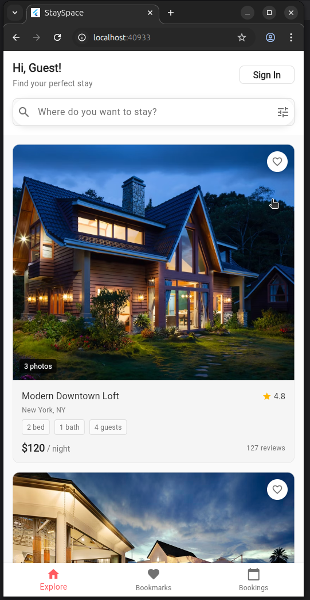
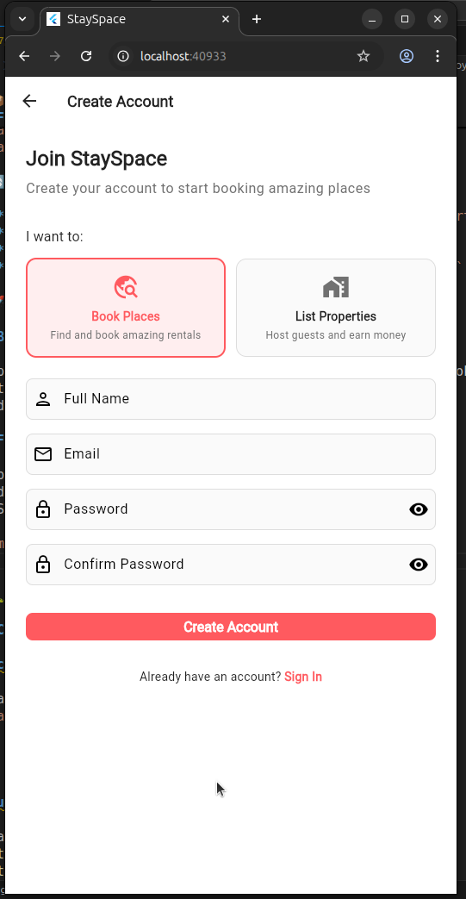

# 🏠 Airbnb-Style Rental App MVP

A beautiful, demo-ready Airbnb-style rental application built with Flutter frontend and Dart backend. Features modern UI/UX with clean, image-first design and comprehensive booking functionality.

## ✨ Features

### 👤 User Features

- **Authentication**: Register, login, logout with JWT tokens
- **Browse Listings**: Explore properties with beautiful image carousels
- **Search & Filter**: Find properties by location, date, and price
- **Bookmarks**: Save favorite properties for later
- **Bookings**: Complete booking flow with calendar selection
- **Profile Management**: View and edit user profile

### 🏢 Landlord Features

- **Property Management**: Add, edit, and delete listings
- **Dashboard**: View booking statistics and property performance
- **Listing Analytics**: Track views and booking rates

### 🔧 Technical Features

- **REST API**: Comprehensive backend with Shelf framework
- **SQLite Database**: Persistent data storage with relationships
- **JWT Authentication**: Secure token-based auth system
- **State Management**: Provider pattern for reactive UI
- **Modern UI**: Airbnb-inspired design with Material 3

## 🚀 Quick Start

### Prerequisites

- Flutter SDK 3.9.2 or higher
- Dart SDK 3.0.0 or higher
- Android Studio / VS Code
- Android device/emulator or iOS simulator

### 1. Clone & Setup

```bash
git clone <repository-url>
cd ss

# ensure flutter is installed
flutter --version # 3.35
# else curl -sS https://webi.sh/flutter | sh

flutter pub get
cd backend && dart pub get && cd ..
```

### 2. Start Backend Server

```bash
cd backend
dart run bin/server.dart
```

Backend will start on `http://localhost:8080`

### 3. Run Flutter App

```bash
flutter run
```

Or use VS Code/Android Studio run configuration

## 📱 Demo Accounts

### Users

- **Email**: `john@example.com` | **Password**: `password123`
- **Email**: `jane@example.com` | **Password**: `password123`

### Landlords

- **Email**: `landlord1@example.com` | **Password**: `password123`
- **Email**: `landlord2@example.com` | **Password**: `password123`

## 🏗️ Architecture

### Backend (`/backend`)

```
backend/
├── bin/server.dart              # Main server entry point
├── lib/
│   ├── database/
│   │   ├── database.dart        # SQLite database service
│   │   └── seed_data.dart       # Demo data seeding
│   ├── models/                  # Data models
│   ├── controllers/             # API route handlers
│   └── services/                # Business logic
└── pubspec.yaml
```

### Frontend (`/lib`)

```
lib/
├── main.dart                    # App entry point
├── models/                      # Data models
├── providers/                   # State management
├── services/                    # API services
├── screens/                     # UI screens
├── widgets/                     # Reusable components
└── theme/                       # App theming
```

## 🔗 API Endpoints

### Authentication

- `POST /auth/register` - Register new user
- `POST /auth/login` - User login
- `GET /auth/me` - Get current user

### Listings

- `GET /listings` - Get all listings
- `GET /listings/:id` - Get listing by ID
- `POST /listings` - Create new listing (landlord)
- `PUT /listings/:id` - Update listing (landlord)
- `DELETE /listings/:id` - Delete listing (landlord)

### Bookmarks

- `GET /bookmarks` - Get user bookmarks
- `POST /bookmarks` - Add bookmark
- `DELETE /bookmarks/:listingId` - Remove bookmark

### Bookings

- `GET /bookings` - Get user bookings
- `POST /bookings` - Create booking
- `PUT /bookings/:id` - Update booking
- `DELETE /bookings/:id` - Cancel booking

## 🎨 Design System

### Colors

- **Primary**: `#FF5A5F` (Airbnb Red)
- **Background**: `#FFFFFF`
- **Surface**: `#F7F7F7`
- **Text**: `#222222`

### Typography

- **Headlines**: Poppins 600
- **Body**: Poppins 400
- **Captions**: Poppins 300

### Components

- **Cards**: Rounded corners (12px), subtle shadows
- **Buttons**: Rounded (8px), gradient backgrounds
- **Images**: Aspect ratio preserved, rounded corners
- **Spacing**: 8px base unit system

## 🧪 Testing

### Backend Tests

```bash
cd backend
dart test
```

### Frontend Tests

```bash
flutter test
```

## 📦 Dependencies

### Backend

- `shelf`: Web server framework
- `shelf_router`: HTTP routing
- `sqlite3`: Database
- `dart_jsonwebtoken`: JWT authentication
- `uuid`: ID generation

### Frontend

- `provider`: State management
- `go_router`: Navigation
- `http`: API calls
- `cached_network_image`: Image caching
- `carousel_slider`: Image carousels

## 🔄 Development Workflow

1. **Backend Changes**: Restart server (`dart run bin/server.dart`)
2. **Frontend Changes**: Hot reload (press `r` in terminal)
3. **Database Changes**: Delete `backend/database.db` to reset
4. **New Dependencies**: Run `flutter pub get` or `dart pub get`

## 🚀 Deployment

### Backend Deployment

- Deploy to any Dart-compatible platform (Google Cloud Run, Heroku)
- Set environment variables for production database
- Update CORS settings for production frontend URL

### Frontend Deployment

- Web: `flutter build web`
- Android: `flutter build apk --release`
- iOS: `flutter build ios --release`





## 🐛 Troubleshooting

### Common Issues

**Backend won't start**

```bash
cd backend
dart pub get
dart run bin/server.dart
```

**Flutter build fails**

```bash
flutter clean
flutter pub get
flutter run
```

**Database issues**

- Delete `backend/database.db` file
- Restart backend server to recreate with seed data

**Network issues**

- Check backend is running on `http://localhost:8080`
- Verify API endpoints in `lib/services/api_service.dart`

## 📝 License

This project is licensed under the MIT License - see the LICENSE file for details.

## 🤝 Contributing

1. Fork the repository
2. Create a feature branch
3. Make your changes
4. Test thoroughly
5. Submit a pull request

## 📞 Support

For issues and questions:

- Check the troubleshooting section
- Review API documentation
- Create an issue on the repository

---

Built with ❤️ using Flutter & Dart
